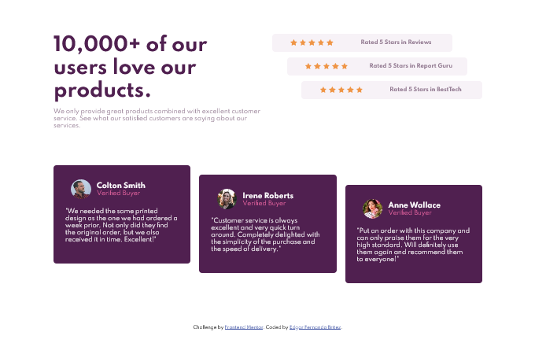

# Frontend Mentor - Social proof section solution

This is a solution to the [Social proof section challenge on Frontend Mentor](https://www.frontendmentor.io/challenges/social-proof-section-6e0qTv_bA). Frontend Mentor challenges help you improve your coding skills by building realistic projects. 

## Table of contents

- [Overview](#overview)
  - [The challenge](#the-challenge)
  - [Screenshot](#screenshot)
  - [Links](#links)
- [My process](#my-process)
  - [Built with](#built-with)
  - [What I learned](#what-i-learned)
  - [Continued development](#continued-development)
  - [Useful resources](#useful-resources)
- [Author](#author)
- [Acknowledgments](#acknowledgments)

## Overview

### The challenge

Users should be able to:

- View the optimal layout for the section depending on their device's screen size

### Screenshot

### Links

- Solution URL: [Github repo](https://github.com/edgarfb/social_proof_section)
- Live Site URL: [social proof section](https://edgarfb.github.io/social_proof_section/)

## My process

### Built with

- Semantic HTML5 markup
- CSS custom properties
- Flexbox
- Mobile-first workflow

### What I learned

I digged more deeper on flexbox and try to use more semantic HTML tags. Also try to separation of concerns in CSS.

### Continued development

Next I want to apply Javascript on my next challenge.

### Useful resources

- Conquering responsive layout by [Kevin Powell](https://courses.kevinpowell.co/conquering-responsive-layouts) - 
This helped me for to achive a better layout. 

## Author

- Website - [Github](https://github.com/edgarfb)
- Frontend Mentor - [edgarfb](https://www.frontendmentor.io/profile/edgarfb)
- Twitter - [@edgarfb_ok](https://www.twitter.com/edgarfb_ok)

## Acknowledgments

I really enjoined and I learned a lot about layout whith the content of [Kevin Powell](https://www.kevinpowell.co/).\
You guys can enroll on [this course](https://courses.kevinpowell.co/conquering-responsive-layouts) totaly free.

